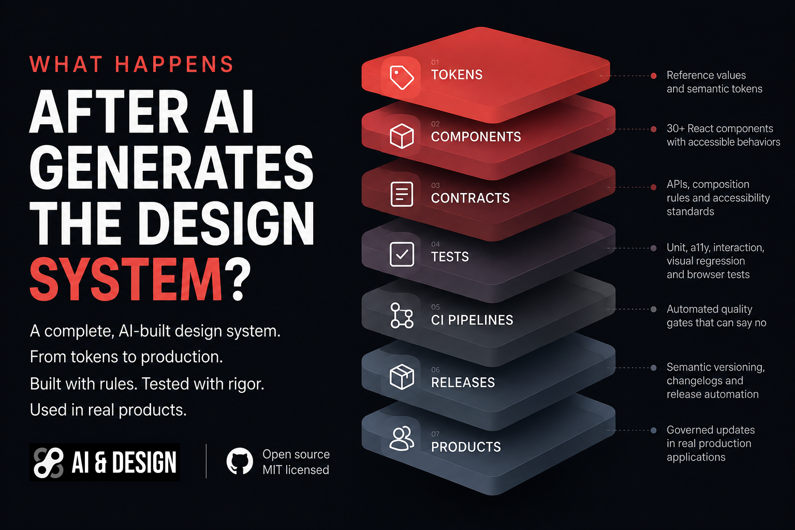

[](https://ui.ai-created.com)

# @ai-created/ui

The open-source design system behind [ai-created.com](https://ai-created.com) and every app that ships from the lab. Licensed under MIT.

One repo. One source of truth. Every component, token, and motion pattern lives here. Consumer apps install it as a dependency and get the full system without copying a single file.

## What's in the box

**19 production components** -- buttons, surfaces, badges, tooltips, modals, form controls, and more. All built with React 19, TypeScript, Tailwind CSS 3, Headless UI, and Framer Motion.

**Design tokens** -- a complete dark-first color system with intentional light mode, semantic status colors, spacing rhythm, radius scale, and motion timing. All delivered as CSS custom properties.

**Tailwind preset** -- the full theme (colors, fonts, letter-spacing, animations, keyframes) as a single preset. Drop it into any Tailwind config and the entire visual language is available.

**Motion helpers** -- shared Framer Motion utilities for fade-in, scroll reveal, hover lift, and border emphasis. Consistent timing across every app.

## Architecture

This package ships **raw TypeScript source**. There is no build step, no compiled output. Consumer apps use Next.js `transpilePackages` to compile it alongside their own code. This means:

- No version mismatch between the package's React and the consumer's React
- Full tree-shaking -- unused components don't ship
- TypeScript types come for free -- no separate `@types` package
- Source is distributed directly, without a compile step or registry publication

## Components

| Component | What it does |
|-----------|-------------|
| `Badge` | Pill-shaped semantic label. 6 variants: default, muted, success, warning, error, info |
| `Button` | Primary, secondary, destructive, ghost, filter, filter-active, icon. Exports `buttonStyles()` for anchors |
| `Checkbox` | Styled binary toggle with native input semantics |
| `ConfirmDialog` | Confirmation alert dialog with loading-safe dismissal behavior |
| `Dialog` | Headless UI modal with focus trap, Escape/backdrop close, size variants |
| `Dropdown` | Single-select listbox with keyboard nav and type-ahead |
| `EmptyState` | Empty content placeholder with optional icon and action |
| `ErrorReport` | Error display with expandable debug info and copy-to-clipboard |
| `Field` | FieldGroup, FieldLabel, FieldLegend, FieldHint, TextInput, TextArea |
| `Modal` | Composable Headless UI modal: Overlay, Panel, Header, Body, Footer |
| `Notice` | Semantic feedback messages. Variants: info, success, warning, error |
| `RadioGroup` | Single-select group with native radio inputs, horizontal/vertical |
| `Skeleton` | Loading placeholder that preserves layout |
| `Slider` | Range input with styled track, red-solid fill, formatted output |
| `Surface` | Card/panel shell with semantic variants and interaction states |
| `Tabs` | Horizontal tab bar with roving tabindex and arrow-key navigation |
| `ThemedHeroImage` | Dark/light theme-aware hero images with overlay and fade controls |
| `Toggle` | On/off switch with role="switch" and sliding track |
| `Tooltip` | Hover/focus/touch hint with position control and ARIA support |

**Utilities:** `cn()` (Tailwind class merging), `fadeUpMotion`, `inViewFadeUpMotion`, `subtleHoverMotion`, `borderHoverMotion`, timing/offset/easing constants.

---

## Setup (new consumer app)

### 1. Install

```bash
npm install --install-links "git+https://github.com/TheMarco/ai-created-ui.git#vX.Y.Z"
```

Replace `vX.Y.Z` with the latest reviewed GitHub Release tag. The `--install-links` flag copies the package instead of symlinking, which avoids TypeScript resolution issues with duplicate `@types/react`.

### 2. Tell Next.js to compile it

```js
// next.config.js
const nextConfig = {
  transpilePackages: ['@ai-created/ui'],
  // ... your other config
};
```

### 3. Use the Tailwind preset

```js
// tailwind.config.js
module.exports = {
  presets: [require('@ai-created/ui/tailwind-preset')],
  content: [
    './src/**/*.{js,ts,jsx,tsx,mdx}',
    './node_modules/@ai-created/ui/src/**/*.{js,ts,jsx,tsx}',  // scan package classes
  ],
};
```

The content path for `node_modules/@ai-created/ui` is critical. Without it, Tailwind purges the classes used inside package components.

### 4. Import the design tokens

In your `globals.css`, **before** the `@tailwind` directives:

```css
@import '@ai-created/ui/styles/tokens.css';

@tailwind base;
@tailwind components;
@tailwind utilities;

/* your site-specific styles below */
```

The `@import` must come first -- CSS requires `@import` rules before other rules.

### 5. Use components

```tsx
import { Badge, Button, Surface, Tooltip, cn, fadeUpMotion } from '@ai-created/ui';
```

Everything comes from one import path. Components, types, utilities, motion helpers -- all from `@ai-created/ui`.

---

## Development workflow

### Quality gates

Install both the library and playground dependencies, then run the single required validation command from the repository root:

```bash
npm ci
npm ci --prefix playground --install-links
npm run validate
```

`npm run validate` typechecks the package and playground, runs React, TypeScript, hooks, and accessibility lint rules, runs the Vitest component and axe accessibility suites, builds the playground, and verifies the packed package boundary.

Browser tests are a separate required CI gate. They start the playground and exercise the desktop and mobile Chromium smoke and visual suites, so a passing `validate` does not replace a passing browser run.

Faster focused commands are available during development:

| Command | Purpose |
|---|---|
| `npm run typecheck` | Typecheck the package and playground |
| `npm run lint` | Lint package source, tests, and playground source |
| `npm test` | Run component behavior and accessibility tests once |
| `npm run test:watch` | Run Vitest in watch mode |
| `npm run test:a11y` | Run the axe accessibility tests only |
| `npm run build:playground` | Build the playground in portable Next.js Webpack mode |
| `npm run validate` | Run the complete non-browser quality gate |
| `npm run test:e2e` | Run the playground smoke tests |
| `npm run test:visual` | Run visual regression tests against committed snapshots |
| `npm run test:visual:update` | Regenerate visual snapshots after an intentional UI change |
| `npm run test:browser` | Run all Playwright browser projects |
| `npm run package:check` | Verify the GitHub package contains only the public source boundary |
| `npm run release:check -- vX.Y.Z` | Verify tag, version, lockfile, npm-publication guard, and changelog agreement |

For browser tests locally, install Chromium once with `npx playwright install chromium`, then run `npm run test:browser` from the repository root. CI installs Chromium with system dependencies and runs this gate after `validate`.

### Reviewing visual baselines

Visual snapshots live with the Playwright suites under `e2e/__screenshots__/`. When a change intentionally alters rendered output, run `npm run test:visual:update`, inspect every updated image and the corresponding diff, and commit only the reviewed baseline changes with the source change. Never update snapshots to hide an unexplained failure. The default Playwright pixel threshold is small, but reviewers still own the final visual decision.

The axe suite catches invalid ARIA, missing accessible names, broken relationships, and related semantic defects. It does not replace browser and manual checks for color contrast, visible focus treatment, screen reader output, touch behavior, or motion quality.

### Live playground

Every component has a demo at **[ui.ai-created.com](https://ui.ai-created.com)**, rendered by the Next.js app in `playground/`. The `file:..` dependency verifies the installed package shape, while the TypeScript, Turbopack, webpack, and Tailwind configuration resolve the repository source directly so edits hot-reload. Most iteration should happen there rather than in a consumer app.

Any component change should be reflected in the playground in the same pass. That is the canonical reference both for future contributors and for anyone hitting the live site.

The playground's design-system reference pages use a manually authored registry at `playground/src/components/design-system/componentDocs.ts`. Keep its API rows, states, accessibility notes, composition guidance, and examples aligned with the current source. The registry is intentionally reviewed documentation, not generated output, so update it alongside public API changes and verify examples in the live playground.

### Editing an existing shared component

1. Open the file in this repo (`src/components/Badge.tsx`, etc.)
2. Make your change
3. Update its playground demo if visible behavior changed
4. Add a concise release-worthy note under `Unreleased` in `CHANGELOG.md`
5. Run `npm run validate` and the applicable browser checks, then commit and push
6. When the change is released, follow `RELEASING.md`. Consumers update through a reviewable release-tag PR, not by following `main`.

### Release governance

The source is public under the MIT License and stable releases are distributed through GitHub tags. `private: true` remains an npm-registry publication guard; it does not restrict repository visibility or source use. Stable releases use matching SemVer in `package.json`, an annotated `vX.Y.Z` Git tag, a dated `CHANGELOG.md` section, and a GitHub Release created only after the complete quality and browser gates pass.

See `RELEASING.md` for the maintainer checklist, `docs/decisions/004-public-source-distribution.md` for the current distribution decision, `docs/consumer-update-automation.md` for the Renovate handoff, and `docs/consumer-compatibility.md` for the validation and future-consumer contract. Changesets are intentionally deferred while this remains one source-distributed package with a small release surface.

### Live development with npm link

If you want changes to appear instantly in a consumer app without reinstalling:

```bash
# One-time setup:
cd /path/to/ai-created-ui
npm link

cd /path/to/your-app
npm link @ai-created/ui
```

Now edits to files in this repo are immediately reflected in the consumer. When done, commit and push the package, then unlink and reinstall from GitHub:

```bash
cd /path/to/your-app
npm unlink @ai-created/ui
npm install --install-links "git+https://github.com/TheMarco/ai-created-ui.git#vX.Y.Z"
```

### Promoting a new component from a consumer app

When you build something in an app (like applyanator) and realize it should be shared:

1. **Copy the component** from your app into this repo's `src/components/`
2. **Fix imports** -- change any `@/lib/utils` to `../lib/utils`. The component should only import from `../lib/utils`, `../lib/motion`, or peer dependencies (react, next, headlessui, lucide, framer-motion). No `@/` path aliases.
3. **Export it** -- add the export to `src/index.ts`
4. **Add release notes and commit** this repo
5. **Add a playground demo** -- extend `playground/src/components/design-system/sections/ComponentsSection.tsx` (or add a new section) so the new component is documented live
6. **Release and update consumers** -- publish the next MINOR GitHub Release, review each Renovate dependency PR, replace the local import with `import { NewComponent } from '@ai-created/ui'`, and delete the local copy

### Adding a new design token

1. Reuse an existing semantic token when its role matches.
2. Add a semantic property to `styles/tokens.css` only for a real shared role. Override it in `html.light` only when the theme value differs.
3. Add a `--ref-*` property only for an opaque value the semantic layer actually needs. Do not create unused scale steps.
4. Map the semantic property, never the reference palette, in `tailwind-preset.js` if a utility is needed.
5. Preserve existing public names with aliases, update `DESIGN-SYSTEM.md`, and verify the playground in both themes.

### Site-specific overrides

Consumer apps can override any token by redeclaring it in their own `globals.css` after the import:

```css
@import '@ai-created/ui/styles/tokens.css';

:root {
  --layout-gutter: 4vw;  /* wider than the default 2vw */
}
```

---

## What belongs here vs. in a consumer app

**Put it here** if it's generic, reusable, and used (or likely to be used) across multiple apps. Buttons, form controls, layout primitives, color tokens, motion helpers.

**Keep it in the consumer** if it's domain-specific. Product cards, provenance cards, URL inputs with GitHub-specific stripping logic, markdown renderers that depend on `react-markdown`. These use the shared primitives but aren't shared themselves.

Rule of thumb: if you'd copy-paste it into the next app, it belongs here.

---

## Current consumers

- **[ai-created.com](https://ai-created.com)** -- product lab portfolio and content platform
- **[Human, Actually](https://human-actually.com)** -- applicant analysis platform (applyanator)

## Attribution appreciated

`@ai-created/ui` is available under the MIT License, so credit is not required beyond the license terms. If the system helps you ship something, a link back helps others discover the project and supports its independent development.

Suggested credit:

> Built with [@ai-created/ui](https://ui.ai-created.com), a design system by Marco van Hylckama Vlieg.

## Contributing and security

Contributions are welcome through reviewed pull requests. Read `CONTRIBUTING.md` before changing public behavior or visual baselines. Report suspected vulnerabilities privately using the process in `SECURITY.md`.

This project is licensed under the [MIT License](LICENSE).
